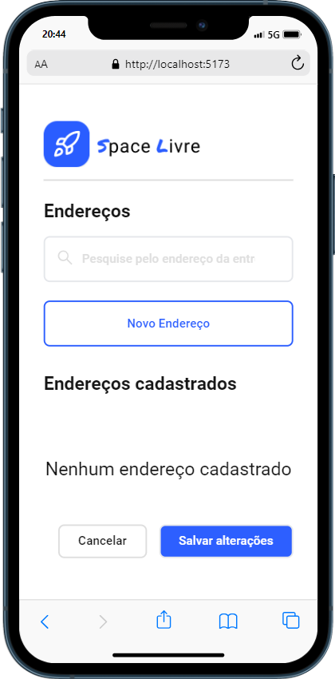
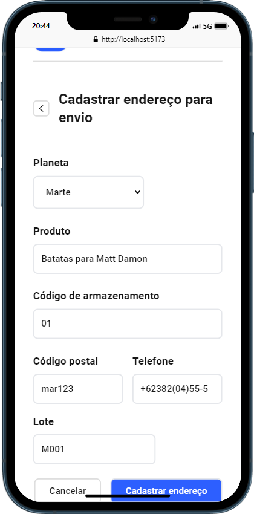
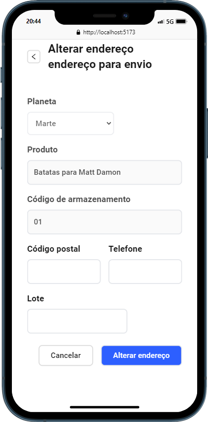
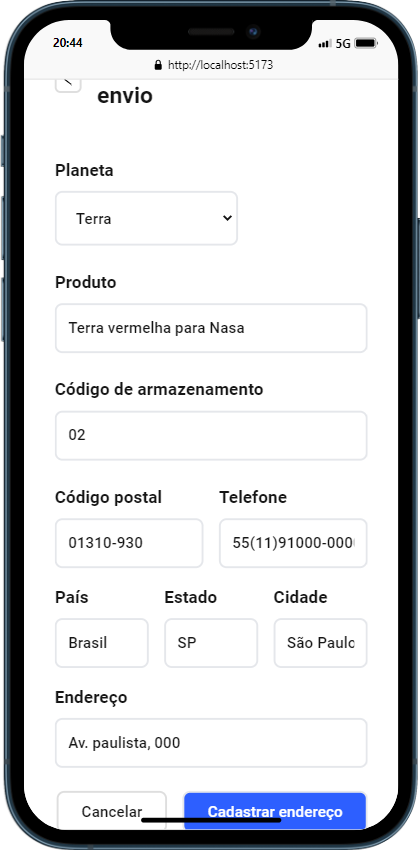

# Desafio técnico Beyond - Desenvolvedor Web |


> Projeto desenvolvido para aplicação a vaga desenvolvedor React. Aplicação é uma etapa do cadastro de endereço de um sistema de delivery entre planetas. É possivel listar todos os endereçõs já cadastrados, filtrar, cadastrar novos endereçõs para os planetas Terra e Marte, onde marte possui apenas LOTES, é possivel editar esses endereços.
> Projetos esta todos responsivo, validações de campos dos formularios, alerts de movimentações com Toast e skeleton para melhorar a UX do usuario.

## 100% Responsive

<div
  style="width:100%; display:flex; gap:16px, flex-wrap: wrap"
>





</div>


## Implantações do projeto

- [x] - Lista de endereços.
- [x] - Filtro por endereço.
- [x] - Tela de cadastro de novo endereço para um planeta.
- [x] - Tela de edição de um endereço.
- [x] - Responsividade
- [x] - Loading e skeleton para melhorar o UX do usuario.
- [x] - Alertas para movimentações
- [x] - validações dos campos dos formularios.


## 💻 Como usar o projeto

<h3>Clone o repositorio</h3>

```bash
git clone https://github.com/Du-devBR/desafio-tecnico-beyond.git
```

```bash
cd space_livre/
```

```bash
npm install
```
> Projeto possui uma api simulada pelo json-server na porta 3000, necessario inciar com os comando abaixo.

<h3>Inicie os servidores</h3>

```bash
cd space_livre/
```

### Api
```bash
npm run server
```
> Abrie um terminal novo

### Frontend
```bash
npm run dev
```

### 🛠 Tecnologias

As seguintes ferramentas foram usadas na construção do projeto:

- [ViteJs](https://vitejs.dev/)
- [React](https://pt-br.reactjs.org/)
- [Tailwindcss](https://tailwindcss.com/)
- [React-query-tanStack](https://tanstack.com/)
- [TypeScript](https://www.typescriptlang.org/)
- [Axios](https://axios-http.com/ptbr/docs/intro)
- [React-hook-form](https://react-hook-form.com/)
